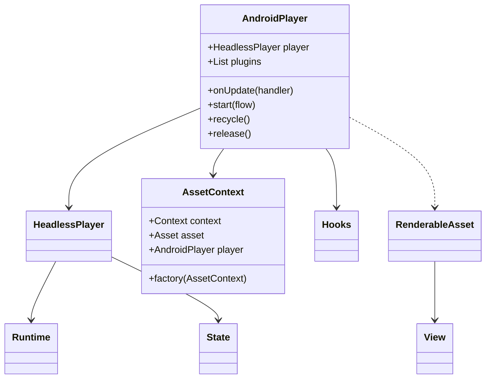

### Core Components Explained

AndroidPlayer

```kotlin
class AndroidPlayer private constructor(
    public val player: HeadlessPlayer,
    override val plugins: List<Plugin> = player.plugins,
) : Player() {
    // Hook System
    public class Hooks internal constructor(hooks: Player.Hooks) {
        // Context management
        public val context: ContextHook = ContextHook()
        // Asset updates
        public val update: UpdateHook = UpdateHook()
        // Resource management
        internal val recycle: RecycleHook = RecycleHook()
        internal val release: ReleaseHook = ReleaseHook()
    }

    // Core functionality
    public fun onUpdate(assetHandler: (RenderableAsset?, Boolean) -> Unit)
    public fun start(flow: String): Completable<CompletedState>
}
```
Key Concepts:
- Acts as the bridge between Player core and Android UI
- Manages asset rendering lifecycle
- Handles state transitions
- Controls resource management


Asset Context System

```kotlin
public data class AssetContext(
    val context: Context?,
    val asset: Asset,
    val player: AndroidPlayer,
    internal val factory: (AssetContext) -> RenderableAsset,
    val id: String
) {
    // Builder pattern extensions
    fun withTag(tag: String): AssetContext
    fun withContext(context: Context): AssetContext
    fun withStyles(@StyleRes vararg styles: Style?): AssetContext
}
```

Usage Example:
```kotlin
// Creating an asset context
val assetContext = AssetContext(
    context = androidContext,
    asset = someAsset,
    player = androidPlayer
) { context -> 
    CustomAsset(context)
}

// Using builder pattern
val styledContext = assetContext
    .withContext(themedContext)
    .withStyles(R.style.CustomStyle)
    .withTag("unique-tag")
```

2. Integration Pattern
Basic Setup
```kotlin
class MainActivity : AppCompatActivity() {
    private lateinit var player: AndroidPlayer
    
    override fun onCreate(savedInstanceState: Bundle?) {
        super.onCreate(savedInstanceState)
        
        // 1. Initialize Player
        player = AndroidPlayer(
            plugins = listOf(
                CommonTypesPlugin(),
                ReferenceAssetsPlugin(),
                CustomPlugin()
            )
        )

        // 2. Handle View Updates
        player.onUpdate { asset, animate ->
            asset?.render(this)?.let { view ->
                view.into(binding.playerContainer)
            }
        }

        // 3. Start Flow
        lifecycleScope.launch {
            player.start(flowContent)
        }
    }

    override fun onDestroy() {
        super.onDestroy()
        player.release()
    }
}
```

ViewModel Integration (Recommended Approach)

```kotlin
class PlayerViewModel(
    flows: AsyncFlowIterator
) : ViewModel(), AndroidPlayerPlugin {
    
    // Core Player instance
    private val player: AndroidPlayer by lazy {
        AndroidPlayer(plugins + this)
    }

    // Exposed state
    private val _state = MutableStateFlow<ManagedPlayerState>(ManagedPlayerState.NotStarted)
    val state: StateFlow<ManagedPlayerState> = _state.asStateFlow()

    init {
        viewModelScope.launch {
            // Monitor state changes
            player.hooks.state.tap { state ->
                when (state) {
                    is InProgressState -> handleProgress(state)
                    is CompletedState -> handleCompletion(state)
                    is ErrorState -> handleError(state)
                }
            }
        }
    }

    // Plugin implementation
    override fun apply(androidPlayer: AndroidPlayer) {
        // Configure player behavior
        androidPlayer.onUpdate { asset, animate ->
            _state.value = ManagedPlayerState.Running(asset, animate)
        }
    }
}
```

3. View Management System
RenderableAsset Base
```kotlin
abstract class RenderableAsset(
    public val assetContext: AssetContext
) : NodeWrapper {
    // Core View Management
    protected abstract fun initView(): View
    protected abstract fun View.hydrate()
    
    // Main Rendering API
    public fun render(context: Context): View

    // Cache Management
    private val cachedAssetView: CachedAssetView
    public fun invalidateView()
}
```

Implementation Example:
```kotlin
class TextAsset(
    assetContext: AssetContext
) : DecodableAsset<TextAsset.Data>(Data.serializer()) {
    
    @Serializable
    data class Data(
        val value: String,
        val style: String? = null
    )

    override fun initView() = TextView(context).apply {
        // One-time setup
        layoutParams = ViewGroup.LayoutParams(
            MATCH_PARENT,
            WRAP_CONTENT
        )
    }

    override fun View.hydrate() {
        require(this is TextView) { "Invalid view type" }
        
        // Update with latest data
        text = data.value
        
        // Apply styles if needed
        data.style?.let { style ->
            // Apply style
        }
    }
}
```
4. Resource Management
```kotlin
class AndroidPlayer {
    // Cache Management
    private val cachedContexts: MutableMap<Pair<Context, Styles>, Context>
    private val cachedAssetViews: MutableMap<String, Pair<AssetContext, View>>
    private val cachedHydrationScopes: MutableMap<String, CoroutineScope>

    // Resource Lifecycle
    public fun recycle() {
        clearCaches()
        hooks.recycle.call()
    }

    public fun release() {
        clearCaches()
        player.release()
        hooks.release.call()
    }
}
```
Key Concepts:
- View caching for performance
- Scope management for coroutines
- Clean resource cleanup
- State preservation
