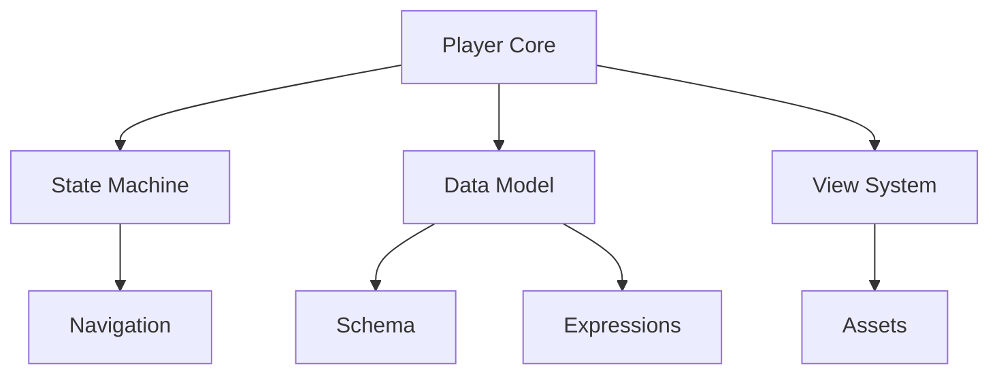
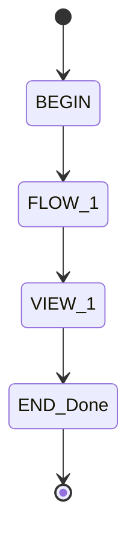
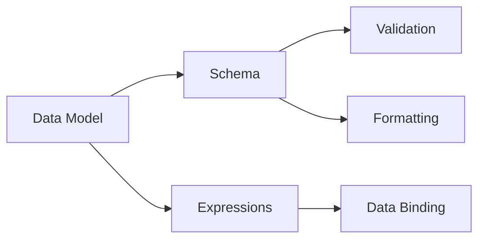
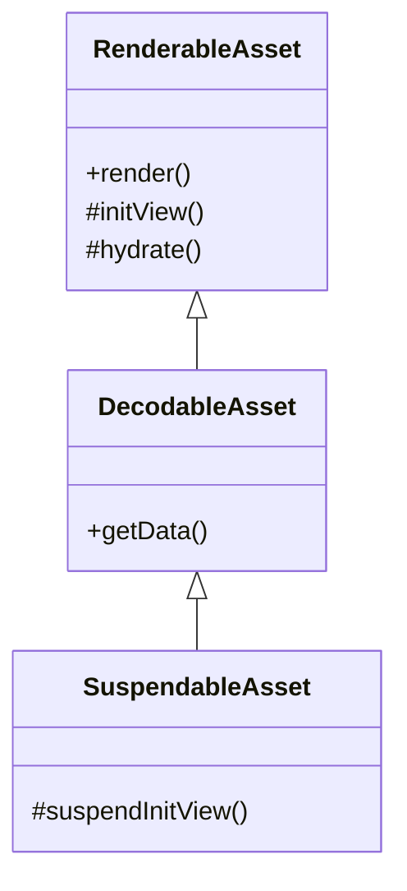
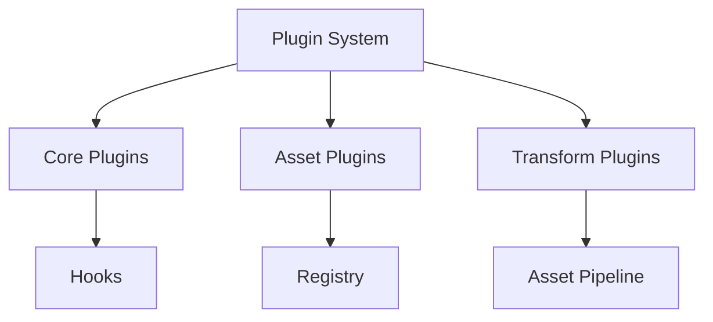

# Player Framework Tutorial Series
## Part 1: Player Core Concepts


1. Introduction to Player

- Core architecture and philosophy
- Runtime architecture
- Basic concepts and terminology
- Flow control and state management


2. Content Structure
```json
{
  "id": "example-flow",
  "views": [...],
  "data": {...},
  "schema": {...},
  "navigation": {...}
}
```

## Part 2: The Navigation System


1. State Machine Architecture

- State types (VIEW, ACTION, EXTERNAL, END)
- Transitions and flows
- State lifecycle and hooks


2. Flow Management
```kotlin
class PlayerViewModel(flows: AsyncFlowIterator) {
    protected val manager: FlowManager
    val state: StateFlow<ManagedPlayerState>
}
```

## Part 3: Data & Schema System


1. Data Management
- Data model structure
- Bindings and expressions
- Schema definition and validation
- Formatting and data types

2. Expression System
```typescript
interface DataController {
  get(binding: string, options?: Options): any
  set(updates: Array<[string, any]>, options?: Options): void
}
```

## Part 4: Asset System


1. Asset Architecture
- Asset lifecycle
- Rendering pipeline
- State management
- Caching strategy

2. Asset Implementation
```kotlin
abstract class RenderableAsset(
    val assetContext: AssetContext
) {
    protected abstract fun initView(): View
    protected abstract fun View.hydrate()
}
```

## Part 5: Plugin System & Extension


1. Plugin Architecture
- Plugin types and interfaces
- Hook system
- Asset registration
- Transform pipeline


2. Creating Custom Plugins
```kotlin
interface AndroidPlayerPlugin : Plugin {
    fun apply(androidPlayer: AndroidPlayer)
}
```
