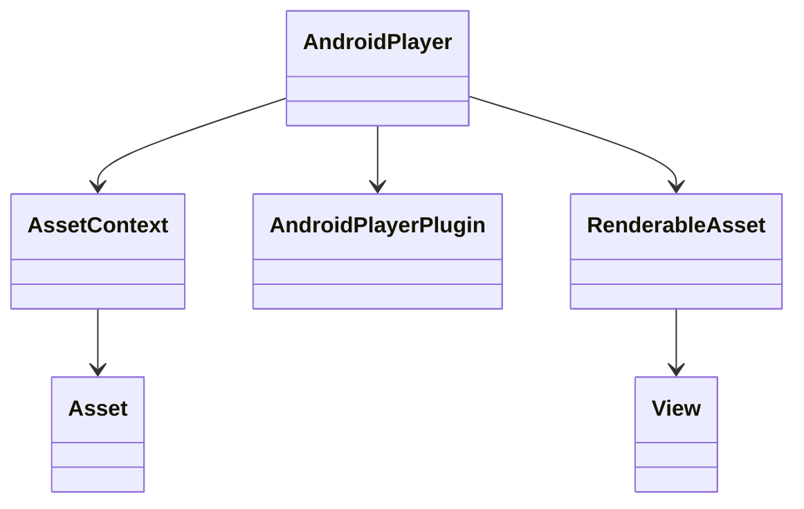
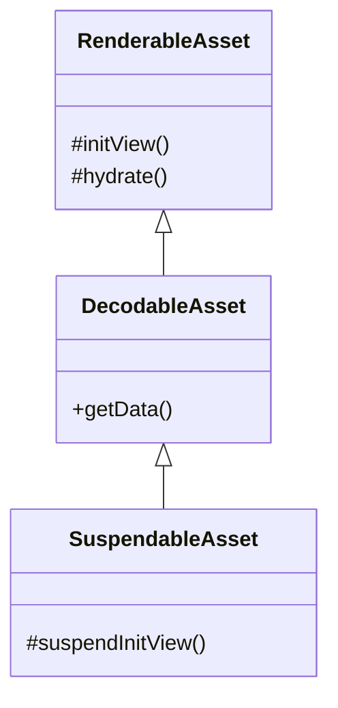
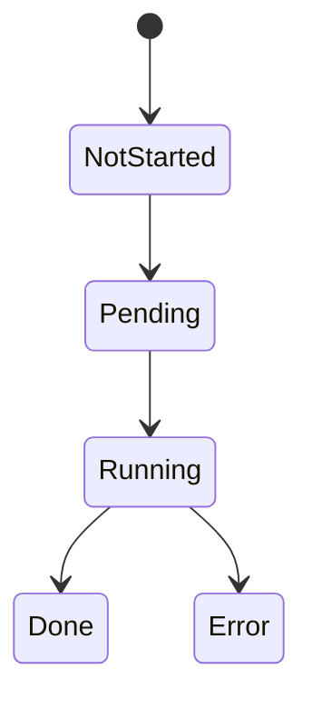
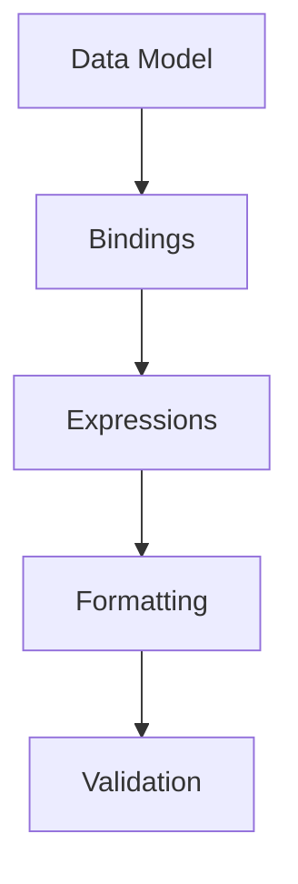
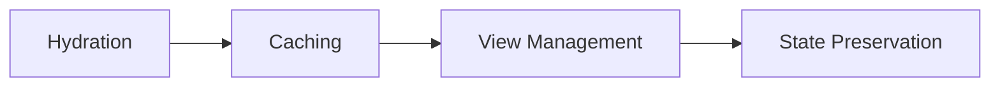

# Android Player Framework Tutorial Series
## Part 1: Android Player Foundation


Core Setup

```kotlin
class AndroidPlayer(
    val player: HeadlessPlayer,
    plugins: List<Plugin>
) : Player() {
    // Core Android Player functionality
    fun onUpdate(assetHandler: (RenderableAsset?, Boolean) -> Unit)
    fun start(flow: String): Completable<CompletedState>
    fun recycle()
    fun release()
}
```

Basic Integration

```kotlin
// Player setup
val player = AndroidPlayer(
    plugins = listOf(
        CommonTypesPlugin(),
        ReferenceAssetsPlugin()
    )
)

// Handle view updates
player.onUpdate { asset: RenderableAsset?, animate: Boolean ->
    asset?.render()?.into(binding.playerContainer)
}
```

## Part 2: Asset System Deep Dive


Creating Custom Assets

```kotlin
class CustomAsset(
    assetContext: AssetContext
) : DecodableAsset<CustomAsset.Data>(Data.serializer()) {
    @Serializable
    data class Data(
        val value: String,
        val binding: String? = null
    )

    override fun initView() = TextView(context)

    override fun View.hydrate() {
        require(this is TextView)
        text = data.value
    }
}
```

Asset Lifecycle Management

```kotlin
// Asset Registration
player.registerAsset("custom", ::CustomAsset)

// Asset Usage
class CustomPlugin : AndroidPlayerPlugin {
    override fun apply(androidPlayer: AndroidPlayer) {
        androidPlayer.registerAsset("custom", ::CustomAsset)
    }
}
```

## Part 3: State & Lifecycle Management


PlayerViewModel Integration

```kotlin
class CustomPlayerViewModel(
    flows: AsyncFlowIterator
) : PlayerViewModel(flows) {
    override val plugins = listOf(
        CommonTypesPlugin(),
        ReferenceAssetsPlugin()
    )

    init {
        viewModelScope.launch {
            state.collect { state ->
                when(state) {
                    is ManagedPlayerState.Running -> handleRunning(state)
                    is ManagedPlayerState.Error -> handleError(state)
                    is ManagedPlayerState.Done -> handleDone(state)
                }
            }
        }
    }
}
```

Fragment Implementation

```kotlin
class CustomPlayerFragment : PlayerFragment() {
    override val playerViewModel by viewModels<CustomPlayerViewModel>()

    override fun buildFallbackView(exception: Exception): View? =
        FallbackBinding.inflate(layoutInflater).apply {
            error.text = exception.message
            retry.setOnClickListener { playerViewModel.retry() }
        }.root

    override fun handleAssetUpdate(
        asset: RenderableAsset?, 
        animate: Boolean
    ) {
        // Handle asset updates
    }
}
```

## Part 4: Data & Expression Handling


Data Management

```kotlin
// Data Access in Assets
class DataAwareAsset(
    assetContext: AssetContext
) : DecodableAsset<DataAwareAsset.Data>(Data.serializer()) {
    
    @Serializable
    data class Data(
        val binding: String,
        val format: String? = null
    )

    override fun View.hydrate() {
        val value = player.dataController.get(
            data.binding,
            formatted = true
        )
        // Use the value
    }
}
```

Expression Handling

```kotlin
Copy// Expression Implementation
class ExpressionAsset(
    assetContext: AssetContext
) : DecodableAsset<ExpressionAsset.Data>(Data.serializer()) {
    
    @Serializable
    data class Data(
        val exp: String
    )

    override fun View.hydrate() {
        val result = player.expressionEvaluator.evaluate(data.exp)
        // Handle result
    }
}
```

## Part 5: Advanced Features


Suspendable Assets

```kotlin
class AsyncAsset(
    assetContext: AssetContext
) : SuspendableAsset<AsyncAsset.Data>(Data.serializer()) {
    
    override suspend fun initView(data: Data): View =
        withContext(Dispatchers.Default) {
            // Async initialization
        }

    override suspend fun View.hydrate(data: Data) {
        // Async hydration
    }
}
```

View Caching & Performance

```kotlin
class CachedAsset(
    assetContext: AssetContext
) : DecodableAsset<CachedAsset.Data>(Data.serializer()) {
    
    override fun initView() = cachedView ?: TextView(context).also {
        cachedView = it
    }

    override fun View.hydrate() {
        // Efficient hydration with cache awareness
    }

    companion object {
        private var cachedView: View? = null
    }
}
```
Each section includes:
