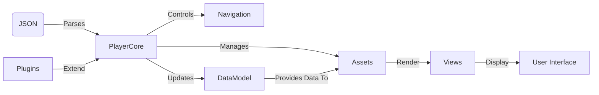

# **Chapter 1: Introduction to the Player Framework**

Welcome to the first chapter of our comprehensive guide on mastering the Player framework on Android using Kotlin and Jetpack Compose. This chapter serves as an in-depth introduction to the Player framework, focusing on the concepts of dynamic content rendering and how the framework addresses modern mobile application challenges.

---

## **1.1 Overview of Dynamic Content Rendering**

### **1.1.1 The Evolution of Mobile Applications**

In the rapidly evolving landscape of mobile applications, users demand personalized and up-to-date experiences. Traditional mobile apps often involve hardcoding UI components and business logic, requiring redeployment for updates or changes. This approach poses significant challenges:

- **Limited Flexibility**: Updating the UI or logic necessitates code changes and app store re-approvals.
- **Scaling Difficulties**: As applications grow, maintaining and scaling monolithic codebases becomes cumbersome.
- **Delayed Updates**: Critical updates or content changes are delayed due to lengthy deployment cycles.

### **1.1.2 Introduction to Dynamic Content Rendering**

Dynamic content rendering is a paradigm where the application's UI and behavior are driven by external data or content, often retrieved at runtime. This approach separates the content from the presentation, allowing for:

- **Real-Time Updates**: Modify UI and behavior without redeploying the app.
- **Personalization**: Tailor experiences based on user data or preferences.
- **Modularity**: Build reusable components that can be composed dynamically.

#### **Benefits of Separating Content from Presentation**

- **Flexibility**: Easily introduce new features or UI changes.
- **Maintainability**: Simplify codebases by decoupling logic from presentation.
- **Cross-Platform Consistency**: Share content definitions across different platforms (e.g., Android, iOS, Web).

### **1.1.3 Challenges in Implementing Dynamic UIs**

While dynamic content rendering offers numerous benefits, it introduces challenges:

- **Complexity in Parsing and Rendering**: Requires robust mechanisms to parse content definitions and render appropriate UI components.
- **State Management**: Handling dynamic data and user interactions can be complex.
- **Performance Considerations**: Ensuring smooth UI performance with dynamic content.

---

## **1.2 Benefits of the Player Framework**

The Player framework is designed to address these challenges by providing a structured approach to dynamic content rendering in Android applications.

### **1.2.1 What is the Player Framework?**

The Player framework is a content-driven engine that interprets JSON-based content to render UI and manage application flow. It consists of several core components:

- **Assets**: Semantic representations of UI elements.
- **Views**: Compositions of assets forming complete screens.
- **Data Model**: Centralized data storage for dynamic content and state.
- **Navigation**: State machine-based flow control.
- **Plugins**: Extensibility mechanisms for custom functionality.

#### **Component Diagram of the Player Framework**



### **1.2.2 How the Player Framework Addresses Dynamic Rendering Challenges**

#### **Modularity**

- **Reusable Components**: Assets represent modular UI components that can be reused across different views.
- **Separation of Concerns**: Decouples content definitions from rendering logic.

#### **Extensibility**

- **Custom Assets and Plugins**: Developers can define new assets or plugins to extend the framework's capabilities.
- **Flexible Data Handling**: The Data Model allows for dynamic data manipulation and binding.

#### **Cross-Platform Compatibility**

- **Shared Content Definitions**: JSON content can be used across different platforms, ensuring consistency.
- **Platform-Specific Rendering**: Each platform can implement rendering logic suited to its UI toolkit (e.g., Jetpack Compose for Android).

#### **Dynamic Navigation and Flow Control**

- **State Machine Architecture**: Navigation is managed through defined states and transitions.
- **Conditional Logic**: Supports dynamic flow based on data conditions and user interactions.

### **1.2.3 Key Advantages**

#### **Ability to Define UI and Logic through JSON Content**

- **Example JSON Content for a View**

  ```json
  {
    "id": "welcome-view",
    "type": "view",
    "assets": [
      {
        "id": "welcome-text",
        "type": "text",
        "value": "Welcome to the Player Framework Tutorial!"
      },
      {
        "id": "start-button",
        "type": "button",
        "label": "Get Started",
        "action": "navigate-next"
      }
    ]
  }
  ```

- **Dynamic Interpretation**: The framework interprets this content at runtime to render the appropriate UI components.

#### **Extensibility Through Custom Assets and Plugins**

- **Custom Asset Example**: A `RatingAsset` that allows users to provide feedback.

  ```json
  {
    "id": "feedback-view",
    "type": "view",
    "assets": [
      {
        "id": "rating",
        "type": "rating",
        "maxRating": 5
      }
    ]
  }
  ```

- **Plugin Architecture**: Developers can create plugins to add new functionality, such as analytics tracking or custom data processing.

---

## **1.3 Objectives and Learning Outcomes**

This tutorial series aims to provide you with a comprehensive understanding of the Player framework's architecture and how to implement it effectively in Android applications using Kotlin and Jetpack Compose.

### **1.3.1 Tutorial Goals**

- **Primary Goal**: Achieve a deep understanding of the Player framework's architecture, components, and implementation patterns.
- **Secondary Goals**:
  - Understand the core components and their interactions.
  - Learn the framework's design patterns and architectural decisions.
  - Master integration and extension mechanisms.
  - Gain proficiency in key abstractions and APIs.

### **1.3.2 What You Will Learn**

- **Layered Architecture**: Understanding how the Player framework is structured in layers and how each layer contributes to the overall functionality.

- **Core Components**:
  - **Assets and Views**: How assets are used to build dynamic UIs.
  - **Data Model**: Managing dynamic data and state within the application.
  - **Navigation**: Controlling application flow using state machines.
  - **Plugins**: Extending the framework with custom functionality.

- **Design Patterns and Best Practices**:
  - Applying software engineering principles within the context of the Player framework.
  - Recognizing and utilizing design patterns such as Factory, Observer, and Strategy.

- **Integration Techniques**:
  - Incorporating the Player framework into existing Android applications.
  - Rendering dynamic content using Jetpack Compose.

- **Extension Mechanisms**:
  - Developing custom assets to meet specific application needs.
  - Creating plugins to enhance or modify framework behavior.

### **1.3.3 Learning Approach**

- **Layered Explanations**: Concepts will be explained starting from high-level overviews down to detailed implementations, leveraging your strong background in software architecture.

- **Visual Aids**: Extensive use of Mermaid diagrams to illustrate:

  - **Component Diagrams**: Showing how different parts of the framework interact.
  - **Class Diagrams**: Detailing the relationships between classes.
  - **Sequence Diagrams**: Demonstrating the flow of operations.
  - **State Diagrams**: Representing the states and transitions within the framework.
  - **Activity Diagrams**: Mapping out the workflow of processes.

- **Code Snippets**: Real-world code examples provided in Kotlin, focusing on clarity and practical application.

- **Hands-On Exercises**: Opportunities to apply concepts through guided exploration and implementation examples.

---

## **Summary**

In this chapter, we've introduced the Player framework and set the stage for a deep dive into its architecture and components. We've highlighted the importance of dynamic content rendering in modern mobile applications and how the Player framework addresses associated challenges through its modular, extensible, and flexible design.

As we proceed to the subsequent chapters, we'll explore each component in detail, starting with setting up the development environment and gradually building up to advanced topics like custom asset development and framework extension. By the end of this tutorial, you will be equipped with the knowledge and skills to effectively utilize the Player framework in your Android applications.

---

## **Next Steps**

- **Proceed to Chapter 2**: Setting up your development environment, including installing necessary tools and configuring your project to use the Player framework.

- **Preparation**: Ensure you have Android Studio installed and updated, and familiarize yourself with basic Kotlin and Jetpack Compose concepts if needed.

If you have any questions or need further clarification on the concepts introduced in this chapter, feel free to revisit the sections or consult additional resources.

---
