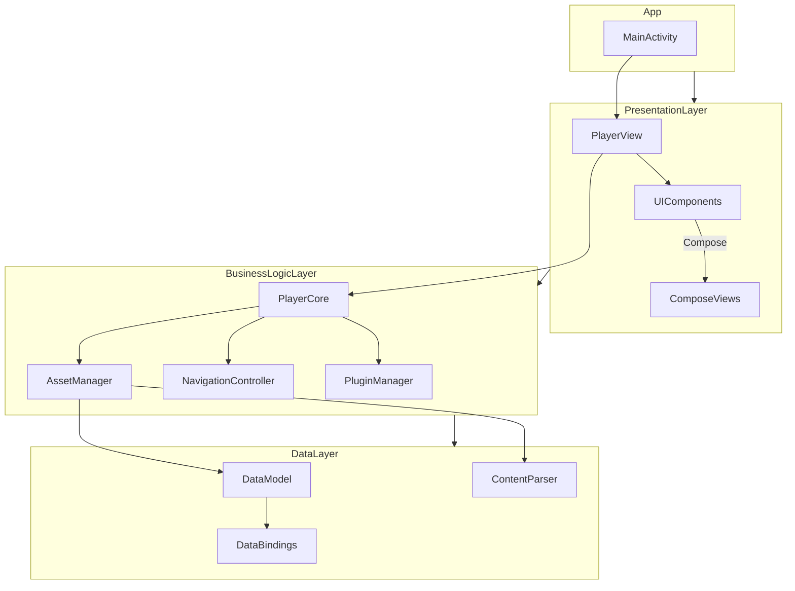
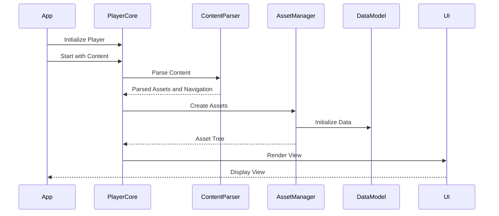
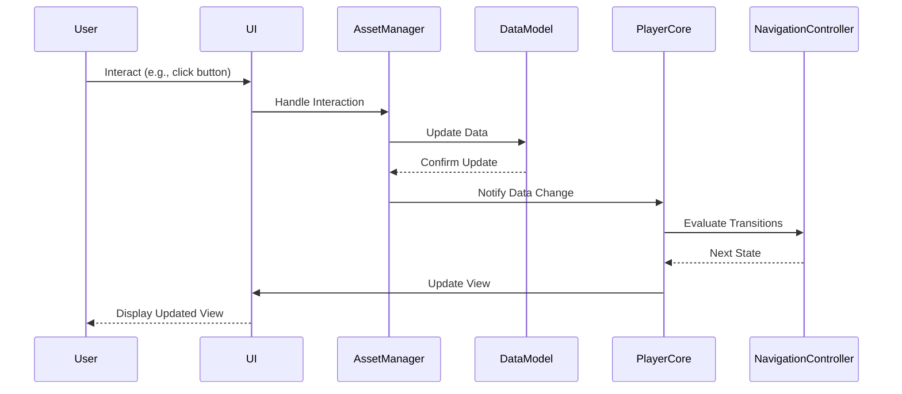
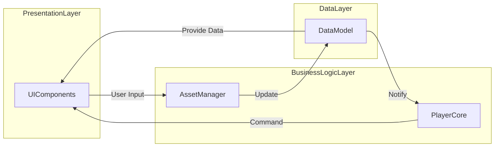

# **Chapter 3: Layered Architecture of the Player Framework**

In this chapter, we'll delve into the layered architecture of the Player framework. Understanding the architecture is crucial for effectively utilizing and extending the framework in your Android applications. We'll break down the system into layers, explore the responsibilities of each layer, and examine how they interact. We'll use Mermaid diagrams to illustrate components, classes, sequences, and states, along with code snippets to reinforce concepts.

---

## **Overview**

- **3.1 High-Level System Architecture**
  - Component Diagram of the Player Framework
- **3.2 Architectural Layers and Responsibilities**
  - Presentation Layer
  - Business Logic Layer
  - Data Layer
- **3.3 Interaction Between Layers**
  - Sequence Diagrams of Core Operations

---

## **3.1 High-Level System Architecture**

### **3.1.1 Introduction**

The Player framework is designed with a layered architecture that promotes separation of concerns, modularity, and scalability. Each layer has specific responsibilities and interacts with other layers through well-defined interfaces.

### **3.1.2 Component Diagram of the Player Framework**

Let's start by visualizing the high-level components and their relationships.



### **3.1.3 Explanation of Components**

- **App**: The Android application that integrates the Player framework.
  - **MainActivity**: The entry point of the app where the Player is initialized.
- **Presentation Layer**: Responsible for rendering the UI using Jetpack Compose.
  - **PlayerView**: The composable that renders content provided by the Player framework.
  - **UIComponents**: Individual UI elements (buttons, text fields, etc.).
  - **ComposeViews**: Jetpack Compose-based views that render assets.
- **Business Logic Layer**: Contains the core logic of the Player framework.
  - **PlayerCore**: The engine that processes content and controls the flow.
  - **AssetManager**: Manages the creation and lifecycle of assets.
  - **NavigationController**: Handles navigation and state transitions.
  - **PluginManager**: Manages plugins that extend the framework's functionality.
- **Data Layer**: Manages data storage and processing.
  - **DataModel**: Stores and manages dynamic data.
  - **ContentParser**: Parses JSON content into usable data structures.
  - **DataBindings**: Handles data binding between the data model and assets.

---

## **3.2 Architectural Layers and Responsibilities**

Let's explore each layer in detail, discussing their responsibilities and how they contribute to the overall architecture.

### **3.2.1 Presentation Layer**

#### **Responsibilities**

- Rendering UI components using Jetpack Compose.
- Displaying views generated by the Player framework.
- Handling user interactions and forwarding events to the Business Logic Layer.

#### **Components**

- **PlayerView**: The main composable function that renders content provided by the Player.
- **UIComponents**: Custom composable functions representing different assets (e.g., TextAsset, ButtonAsset).
- **ComposeViews**: Composed UI elements that are rendered on the screen.

#### **Code Snippet: PlayerView Implementation**

```kotlin
@Composable
fun PlayerView(player: AndroidPlayer) {
    val viewState by player.viewState.collectAsState()

    when (val state = viewState) {
        is ViewState.Loading -> CircularProgressIndicator()
        is ViewState.Content -> {
            RenderAsset(asset = state.asset)
        }
        is ViewState.Error -> Text("Error: ${state.message}")
    }
}
```

#### **Explanation**

- **PlayerView** observes the player's view state and renders the appropriate UI.
- **RenderAsset** is a composable function that renders the asset using the appropriate UI component.

### **3.2.2 Business Logic Layer**

#### **Responsibilities**

- Processing content and managing the flow of the application.
- Managing assets and their lifecycles.
- Handling navigation and state transitions.
- Managing plugins for extensibility.

#### **Components**

- **PlayerCore**: The main engine driving the framework.
- **AssetManager**: Creates and manages assets based on content.
- **NavigationController**: Controls the navigation flow.
- **PluginManager**: Allows adding custom functionality through plugins.

#### **Code Snippet: Player Initialization**

```kotlin
class MainActivity : ComponentActivity() {
    private lateinit var player: AndroidPlayer

    override fun onCreate(savedInstanceState: Bundle?) {
        super.onCreate(savedInstanceState)

        // Initialize the Player with plugins
        player = AndroidPlayer(plugins = listOf(ReferenceAssetsPlugin(), CustomAssetsPlugin()))

        // Start the player with content
        val content = loadContent("sample_content.json")
        player.start(content)

        setContent {
            PlayerFrameworkTutorialTheme {
                PlayerView(player = player)
            }
        }
    }
}
```

#### **Explanation**

- **AndroidPlayer** is initialized with plugins to extend functionality.
- **player.start(content)** begins processing the content and managing the flow.

### **3.2.3 Data Layer**

#### **Responsibilities**

- Storing and managing dynamic data used by the application.
- Parsing JSON content into data structures.
- Handling data bindings between the data model and assets.

#### **Components**

- **DataModel**: Stores data that assets can read from and write to.
- **ContentParser**: Parses JSON content into a format that the Player can process.
- **DataBindings**: Facilitates two-way data binding between UI components and the data model.

#### **Code Snippet: Accessing the Data Model**

```kotlin
// In an Asset's hydrate method
override fun View.hydrate() {
    val userName = assetContext.dataModel.get("user.name") as? String ?: "Guest"

    if (this is TextView) {
        text = "Hello, $userName!"
    }
}
```

#### **Explanation**

- Assets use the **DataModel** to retrieve and update data dynamically.
- The data model ensures consistency across different parts of the application.

---

## **3.3 Interaction Between Layers**

Understanding how layers interact is crucial for grasping the flow of data and control within the framework.

### **3.3.1 Sequence Diagrams of Core Operations**

We'll examine sequence diagrams for two core operations:

1. **Content Loading and View Rendering**
2. **User Interaction and Data Update**

#### **3.3.1.1 Content Loading and View Rendering**



#### **Explanation**

- **App** initializes the **PlayerCore** and starts it with content.
- **PlayerCore** uses the **ContentParser** to parse the JSON content.
- **AssetManager** creates assets based on the parsed content and initializes the **DataModel**.
- The **UI** renders the view by composing assets into a visual representation.

#### **3.3.1.2 User Interaction and Data Update**



#### **Explanation**

- **User** interacts with the **UI** (e.g., clicks a button).
- **UI** delegates the interaction handling to the **AssetManager**.
- **AssetManager** updates the **DataModel** based on the interaction.
- **PlayerCore** is notified of the data change and consults the **NavigationController** for the next state.
- **UI** updates the view to reflect any changes.

### **3.3.2 Data Flow Between Layers**

#### **Data Flow Diagram**



#### **Explanation**

- **UIComponents** capture user input and pass it to the **AssetManager**.
- **AssetManager** updates the **DataModel**.
- **DataModel** notifies **PlayerCore** of data changes.
- **PlayerCore** may command **UIComponents** to update the UI based on new data.
- **UIComponents** access the **DataModel** to display updated information.

---

## **Summary**

In this chapter, we've explored the layered architecture of the Player framework, breaking it down into:

- **Presentation Layer**: Handles rendering UI and capturing user interactions using Jetpack Compose.
- **Business Logic Layer**: Manages the core functionality, including processing content, asset management, and navigation.
- **Data Layer**: Responsible for data storage, parsing content, and data binding.

We've examined how these layers interact through sequence diagrams, highlighting the flow of data and control within the system. Understanding this architecture is crucial for effectively integrating and extending the Player framework in your applications.

---

## **Exercises**

### **Exercise 3.1: Analyze a Sample Data Model**

- **Objective**: Understand the structure of the DataModel and how data is stored and accessed.

- **Instructions**:

  1. Create a simple JSON content file that includes data definitions.

     ```json
     {
       "data": {
         "user": {
           "name": "Alice",
           "age": 30
         }
       },
       "views": [
         {
           "id": "welcome-view",
           "type": "view",
           "assets": [
             {
               "id": "welcome-text",
               "type": "text",
               "value": "Welcome, {{user.name}}!"
             }
           ]
         }
       ]
     }
     ```

  2. Load this content into the Player and examine how the data is stored in the DataModel.

- **Tasks**:

  - Identify how the data is accessed within an asset.
  - Modify the data programmatically and observe how the UI updates.

### **Exercise 3.2: Trace the Data Flow from DataModel to UI**

- **Objective**: Understand how changes in the DataModel propagate to the UI.

- **Instructions**:

  1. In the previous example, add a button that changes the user's name when clicked.

     ```json
     {
       "id": "change-name-button",
       "type": "button",
       "label": "Change Name",
       "action": "changeName"
     }
     ```

  2. Implement the action in your code to update `user.name` in the DataModel.

- **Tasks**:

  - Observe how updating the DataModel affects the UI.
  - Draw a sequence diagram showing the flow of data when the button is clicked.

---

## **Next Steps**

- **Proceed to Chapter 4**: We'll dive deeper into the core components of the Player framework, focusing on assets, views, navigation, and plugins.

- **Preparation**:

  - Review the code examples provided in this chapter.
  - Ensure that you understand how the layers interact and how data flows through the system.

If you have any questions or need clarification on any of the concepts covered, feel free to revisit the sections or consult additional resources.

---

## **Additional Resources**

- **Official Documentation**: [Player Framework Documentation](https://example.com/player-docs)
- **Jetpack Compose**: [Compose Tutorial](https://developer.android.com/jetpack/compose/tutorial)
- **Kotlin Coroutines**: [Coroutines Guide](https://kotlinlang.org/docs/coroutines-guide.html)

---
