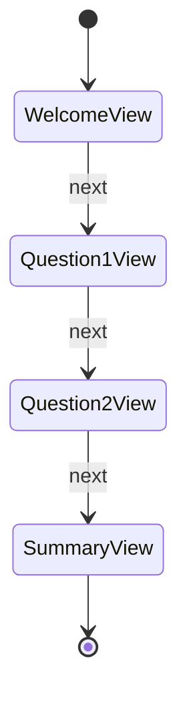

# **Chapter 4: Building Your First Dynamic Application with the Player Framework**

In this chapter, we'll step away from the theoretical aspects and dive into building a real Android application using Jetpack Compose and the Player framework. This hands-on approach will give you a concrete understanding of how the framework works in practice. As we progress through the tutorial, we'll use this application as a foundation to explore deeper concepts and expand its functionality in subsequent chapters.

---

## **Overview**

- **4.1 Introduction to the Sample Application**
  - Application Features and Goals
  - High-Level Architecture
- **4.2 Setting Up the Project**
  - Project Configuration
  - Adding Dependencies
- **4.3 Designing the Content Flow**
  - Defining the JSON Content
  - Navigation Structure
- **4.4 Implementing the Application**
  - Initializing the Player
  - Loading and Parsing Content
  - Rendering Views with Jetpack Compose
- **4.5 Handling User Interactions**
  - Capturing Input Data
  - Updating the Data Model
- **4.6 Testing the Application**
  - Running on an Emulator or Device
  - Verifying Functionality
- **4.7 Summary and Next Steps**

---

## **4.1 Introduction to the Sample Application**

### **4.1.1 Application Features and Goals**

We'll build a **Dynamic Survey Application** that allows users to:

- **Navigate Through Multiple Questions**: The survey will consist of several questions, each presented on a separate screen.
- **Provide Responses**: Users can input text, select options, or rate items.
- **Dynamic Flow Control**: The flow can change based on user responses (e.g., branching questions).
- **Display Results**: At the end of the survey, display a summary of the user's responses.

### **4.1.2 High-Level Architecture**

The application leverages the Player framework to dynamically render content based on JSON definitions. The architecture includes:

- **Content Definition**: JSON files that describe the survey questions, assets, and navigation.
- **Player Core**: Processes the content and manages navigation.
- **Assets and Views**: Represent survey questions and input components.
- **Data Model**: Stores user responses and application state.
- **Presentation Layer**: Uses Jetpack Compose to render the UI.

---

## **4.2 Setting Up the Project**

We'll start by configuring our project to support the application.

### **4.2.1 Project Configuration**

1. **Create a New Project or Use Existing One**:

   - If you completed Chapter 2, you can continue using the `PlayerFrameworkTutorial` project.
   - Alternatively, create a new project named `DynamicSurveyApp` with Jetpack Compose support.

2. **Update Application ID**:

   - In `build.gradle` (Module: app), set the `applicationId`:

     ```gradle
     defaultConfig {
         applicationId "com.example.dynamicsurveyapp"
         // Other configurations...
     }
     ```

### **4.2.2 Adding Dependencies**

Ensure that the following dependencies are included in your `build.gradle` (Module: app):

```gradle
dependencies {
    // Existing dependencies...
    implementation "androidx.core:core-ktx:1.6.0"
    implementation "androidx.compose.ui:ui:1.0.5"
    implementation "androidx.compose.material:material:1.0.5"
    implementation "androidx.compose.ui:ui-tooling-preview:1.0.5"
    implementation "androidx.activity:activity-compose:1.3.1"

    // Player framework dependencies
    implementation "com.intuit.player:player-core:1.0.0"
    implementation "com.intuit.player:player-android:1.0.0"
    implementation "com.intuit.player:player-plugins:1.0.0"
    implementation "com.intuit.player:player-reference-assets:1.0.0"

    // Coroutines
    implementation "org.jetbrains.kotlinx:kotlinx-coroutines-android:1.5.2"

    // Other dependencies...
}
```

**Note**: Replace version numbers with the latest available versions.

---

## **4.3 Designing the Content Flow**

The survey application relies on JSON content to define its flow, questions, and navigation.

### **4.3.1 Defining the JSON Content**

We'll create a JSON file named `survey_content.json` in the `assets` directory.

#### **4.3.1.1 Creating the Assets Directory**

1. **Create Directory**:

   - In Android Studio, right-click on the `app/src/main` directory.
   - Select **New > Directory**.
   - Name it `assets`.

2. **Add the JSON File**:

   - Right-click on the `assets` directory.
   - Select **New > File**.
   - Name it `survey_content.json`.

#### **4.3.1.2 Writing the Survey Content**

Here's the content of `survey_content.json`:

```json
{
  "id": "survey-flow",
  "views": [
    {
      "id": "welcome-view",
      "type": "view",
      "assets": [
        {
          "id": "welcome-text",
          "type": "text",
          "value": "Welcome to the Dynamic Survey!"
        },
        {
          "id": "start-button",
          "type": "action",
          "label": {
            "asset": {
              "id": "start-button-text",
              "type": "text",
              "value": "Start Survey"
            }
          },
          "value": "next"
        }
      ]
    },
    {
      "id": "question-1-view",
      "type": "view",
      "assets": [
        {
          "id": "question-1-text",
          "type": "text",
          "value": "What is your favorite color?"
        },
        {
          "id": "question-1-input",
          "type": "input",
          "binding": "userResponses.favoriteColor"
        },
        {
          "id": "question-1-next",
          "type": "action",
          "label": {
            "asset": {
              "id": "question-1-next-text",
              "type": "text",
              "value": "Next"
            }
          },
          "value": "next"
        }
      ]
    },
    {
      "id": "question-2-view",
      "type": "view",
      "assets": [
        {
          "id": "question-2-text",
          "type": "text",
          "value": "Rate your satisfaction with our service."
        },
        {
          "id": "question-2-rating",
          "type": "rating",
          "maxRating": 5,
          "binding": "userResponses.satisfactionRating"
        },
        {
          "id": "question-2-next",
          "type": "action",
          "label": {
            "asset": {
              "id": "question-2-next-text",
              "type": "text",
              "value": "Next"
            }
          },
          "value": "next"
        }
      ]
    },
    {
      "id": "summary-view",
      "type": "view",
      "assets": [
        {
          "id": "summary-text",
          "type": "text",
          "value": "Thank you for completing the survey!"
        },
        {
          "id": "favorite-color-summary",
          "type": "text",
          "value": "Your favorite color is: {{userResponses.favoriteColor}}"
        },
        {
          "id": "satisfaction-rating-summary",
          "type": "text",
          "value": "Your satisfaction rating is: {{userResponses.satisfactionRating}}"
        }
      ]
    }
  ],
  "navigation": {
    "BEGIN": "FLOW_1",
    "FLOW_1": {
      "startState": "VIEW_welcome",
      "VIEW_welcome": {
        "state_type": "VIEW",
        "ref": "welcome-view",
        "transitions": {
          "next": "VIEW_question_1"
        }
      },
      "VIEW_question_1": {
        "state_type": "VIEW",
        "ref": "question-1-view",
        "transitions": {
          "next": "VIEW_question_2"
        }
      },
      "VIEW_question_2": {
        "state_type": "VIEW",
        "ref": "question-2-view",
        "transitions": {
          "next": "VIEW_summary"
        }
      },
      "VIEW_summary": {
        "state_type": "VIEW",
        "ref": "summary-view",
        "transitions": {}
      }
    }
  }
}
```

### **4.3.2 Navigation Structure**

#### **4.3.2.1 State Diagram of Navigation Flow**



#### **4.3.2.2 Explanation**

- **WelcomeView**: Displays a welcome message and a button to start the survey.
- **Question1View**: Asks for the user's favorite color.
- **Question2View**: Asks the user to rate their satisfaction.
- **SummaryView**: Displays a summary of the user's responses.
- **Transitions**: The `next` action moves the user from one view to the next.

---

## **4.4 Implementing the Application**

With the content defined, we'll now implement the application to process and render this content.

### **4.4.1 Initializing the Player**

In `MainActivity.kt`, we'll initialize the Player and load the content.

#### **4.4.1.1 Import Necessary Classes**

At the top of `MainActivity.kt`, add the following imports:

```kotlin
import com.intuit.player.android.AndroidPlayer
import com.intuit.player.plugins.reference.assets.ReferenceAssetsPlugin
import com.intuit.player.android.views.PlayerView
import com.intuit.player.android.Asset
import kotlinx.coroutines.flow.collect
import kotlinx.coroutines.launch
import androidx.compose.runtime.livedata.observeAsState
import androidx.lifecycle.lifecycleScope
```

#### **4.4.1.2 Initialize the Player**

```kotlin
class MainActivity : ComponentActivity() {

    private lateinit var player: AndroidPlayer

    override fun onCreate(savedInstanceState: Bundle?) {
        super.onCreate(savedInstanceState)

        // Initialize the Player with the Reference Assets Plugin
        player = AndroidPlayer(plugins = listOf(ReferenceAssetsPlugin()))

        // Load and start the Player with content
        val content = loadContentFromAssets("survey_content.json")
        player.start(content)

        setContent {
            PlayerFrameworkTutorialTheme {
                Surface(color = MaterialTheme.colors.background) {
                    PlayerView(player = player)
                }
            }
        }
    }

    private fun loadContentFromAssets(fileName: String): String {
        return assets.open(fileName).bufferedReader().use { it.readText() }
    }
}
```

**Explanation**:

- **player**: An instance of `AndroidPlayer` initialized with `ReferenceAssetsPlugin` to support default assets.
- **loadContentFromAssets**: A helper function to read the JSON content from the `assets` directory.
- **player.start(content)**: Starts the Player with the loaded content.
- **PlayerView**: A composable function provided by the Player framework to render the content.

### **4.4.2 Rendering Views with Jetpack Compose**

The `PlayerView` composable function automatically observes the Player's state and renders the content using Jetpack Compose.

#### **4.4.2.1 Using PlayerView**

Ensure that you have the following in your `setContent` block:

```kotlin
setContent {
    PlayerFrameworkTutorialTheme {
        Surface(color = MaterialTheme.colors.background) {
            PlayerView(player = player)
        }
    }
}
```

#### **4.4.2.2 Customizing Asset Rendering**

For more control over how assets are rendered, you can implement custom composable functions.

**Example**: Custom rendering for a `TextAsset`.

```kotlin
@Composable
fun CustomRenderAsset(asset: Asset) {
    when (asset.type) {
        "text" -> {
            val value = asset.properties["value"] as? String ?: ""
            Text(text = value)
        }
        // Handle other asset types...
        else -> Text("Unsupported asset type: ${asset.type}")
    }
}
```

**Note**: For the purposes of this chapter, we'll rely on the default `PlayerView` implementation.

### **4.4.3 Handling Assets Not Provided by Reference Assets Plugin**

Our survey content includes an asset of type `rating`, which is not part of the `ReferenceAssetsPlugin`. We'll need to implement and register this custom asset.

#### **4.4.3.1 Implementing the RatingAsset**

Create a new Kotlin file named `CustomAssets.kt`.

```kotlin
// CustomAssets.kt
package com.example.dynamicsurveyapp

import android.view.View
import android.widget.RatingBar
import com.intuit.player.android.asset.DecodableAsset
import com.intuit.player.jvm.core.asset.AssetContext
import kotlinx.serialization.Serializable
import androidx.compose.ui.viewinterop.AndroidView
import androidx.compose.runtime.Composable
import com.intuit.player.android.views.ViewRenderableAsset

class RatingAsset(assetContext: AssetContext) :
    DecodableAsset<RatingAsset.Data>(assetContext, Data.serializer()), ViewRenderableAsset {

    @Serializable
    data class Data(
        val maxRating: Int = 5,
        val binding: String? = null
    )

    override fun initView(): View {
        return RatingBar(requireContext()).apply {
            numStars = data.maxRating
            stepSize = 1f
        }
    }

    override fun View.hydrate() {
        if (this !is RatingBar) return

        setIsIndicator(false)
        rating = getBoundRating()?.toFloat() ?: 0f

        setOnRatingBarChangeListener { _, newRating, _ ->
            data.binding?.let {
                assetContext.data?.set(it, newRating.toInt())
            }
        }
    }

    private fun getBoundRating(): Int? {
        return data.binding?.let {
            assetContext.data?.get(it) as? Int
        }
    }

    @Composable
    override fun Compose() {
        val ratingValue = getBoundRating() ?: 0

        AndroidView(factory = {
            RatingBar(it).apply {
                numStars = data.maxRating
                stepSize = 1f
                rating = ratingValue.toFloat()
                setOnRatingBarChangeListener { _, newRating, _ ->
                    data.binding?.let { binding ->
                        assetContext.data?.set(binding, newRating.toInt())
                    }
                }
            }
        })
    }
}
```

**Explanation**:

- **RatingAsset**: A custom asset that renders a `RatingBar`.
- **Data**: Contains `maxRating` and `binding` properties.
- **initView** and **hydrate**: Initialize and update the `RatingBar` view.
- **Compose**: Provides a Jetpack Compose implementation for the asset.

#### **4.4.3.2 Registering the Custom Asset**

In `MainActivity.kt`, update the Player initialization to include the custom asset.

```kotlin
class MainActivity : ComponentActivity() {

    private lateinit var player: AndroidPlayer

    override fun onCreate(savedInstanceState: Bundle?) {
        super.onCreate(savedInstanceState)

        // Initialize the Player with the Reference Assets Plugin and Custom Assets Plugin
        player = AndroidPlayer(plugins = listOf(ReferenceAssetsPlugin(), CustomAssetsPlugin()))

        // Rest of the code...
    }

    // Rest of the code...
}
```

Create a new class `CustomAssetsPlugin.kt`:

```kotlin
// CustomAssetsPlugin.kt
package com.example.dynamicsurveyapp

import com.intuit.player.android.AndroidPlayer
import com.intuit.player.android.AndroidPlayerPlugin

class CustomAssetsPlugin : AndroidPlayerPlugin {
    override fun apply(player: AndroidPlayer) {
        player.assetRegistry.register("rating", ::RatingAsset)
    }
}
```

---

## **4.5 Handling User Interactions**

We need to ensure that user inputs are captured and stored in the Data Model.

### **4.5.1 Capturing Input Data**

The `input` asset in our survey allows the user to enter their favorite color.

#### **4.5.1.1 Ensuring InputAsset is Registered**

The `ReferenceAssetsPlugin` includes support for basic input assets. If needed, you can implement a custom `InputAsset`.

### **4.5.2 Updating the Data Model**

User inputs are bound to the Data Model via the `binding` property in the asset definition.

- **Example**: `"binding": "userResponses.favoriteColor"`

When the user provides input, the asset updates the Data Model at the specified path.

### **4.5.3 Accessing Data in Assets**

In the summary view, we display the user's responses using data bindings in the `text` assets.

- **Example**: `"value": "Your favorite color is: {{userResponses.favoriteColor}}"`

The Player framework processes these expressions and replaces them with the actual data from the Data Model.

---

## **4.6 Testing the Application**

Now that we've implemented the application, let's test it.

### **4.6.1 Running on an Emulator or Device**

1. **Build the Project**:

   - Click **"Build > Make Project"** to ensure there are no compilation errors.

2. **Run the Application**:

   - Connect a device or start an emulator.
   - Click the **"Run"** button.
   - Select your device or emulator.

### **4.6.2 Verifying Functionality**

Walk through the survey:

1. **Welcome Screen**:

   - Verify that the welcome message and "Start Survey" button are displayed.
   - Click **"Start Survey"**.

2. **Question 1**:

   - Verify that the question "What is your favorite color?" is displayed.
   - Enter a color (e.g., "Blue").
   - Click **"Next"**.

3. **Question 2**:

   - Verify that the rating question is displayed.
   - Provide a satisfaction rating.
   - Click **"Next"**.

4. **Summary Screen**:

   - Verify that the summary displays the correct responses.
     - "Your favorite color is: Blue"
     - "Your satisfaction rating is: [Your Rating]"

### **4.6.3 Troubleshooting**

- **Issue**: Assets not displaying correctly.
  - **Solution**: Ensure all assets are registered properly, and the JSON content is correctly formatted.
- **Issue**: User inputs not updating the Data Model.
  - **Solution**: Verify that the `binding` paths are correct and that assets are correctly implemented to handle data updates.

---

## **4.7 Summary and Next Steps**

In this chapter, we've:

- Built a dynamic survey application using the Player framework and Jetpack Compose.
- Defined JSON content to represent the survey flow, questions, and navigation.
- Implemented custom assets (e.g., `RatingAsset`) and registered them with the Player.
- Handled user interactions and updated the Data Model.
- Tested the application to verify functionality.

This practical exercise provides a concrete understanding of how the Player framework operates within an Android application. We'll use this application as a reference point in subsequent chapters to delve deeper into the framework's components, patterns, and extension mechanisms.

---

## **Exercises**

### **Exercise 4.1: Add a New Question to the Survey**

- **Objective**: Extend the survey by adding a new question that asks the user to select their preferred contact method.

- **Instructions**:

  1. **Update `survey_content.json`**:

     - Add a new view `question-3-view` after `question-2-view`.
     - Include assets for the question text and options (e.g., "Email", "Phone", "SMS").
     - Use an asset type that allows for selection (e.g., `choice` or `select`).

  2. **Update Navigation**:

     - Modify the `transitions` in `VIEW_question_2` to point to `VIEW_question_3`.
     - Add `VIEW_question_3` to the navigation flow.

- **Tasks**:

  - Implement any custom assets if needed.
  - Ensure the user's selection is stored in the Data Model.
  - Display the response in the summary view.

### **Exercise 4.2: Implement Validation**

- **Objective**: Add validation to ensure that the user provides input for required questions.

- **Instructions**:

  1. **Modify Assets**:

     - Add validation logic to the `input` asset for the favorite color question.

  2. **Display Error Messages**:

     - If validation fails, display an error message prompting the user to provide input.

- **Tasks**:

  - Update the `InputAsset` implementation if necessary.
  - Ensure that the validation logic interacts correctly with the Player's navigation flow.

---

## **Next Steps**

- **Proceed to Chapter 5**: We'll explore the core components and their interactions in more detail, using the application we've built as a reference.

- **Preparation**:

  - Review the code and content we've created in this chapter.
  - Familiarize yourself with the custom assets and how they integrate with the Player framework.

If you have any questions or encounter any issues while working through this chapter, feel free to revisit the sections or consult additional resources.

---

## **Additional Resources**

- **Official Documentation**: [Player Framework Documentation](https://example.com/player-docs)
- **Jetpack Compose**: [Compose Tutorial](https://developer.android.com/jetpack/compose/tutorial)
- **Kotlin Serialization**: [Kotlin Serialization Guide](https://kotlinlang.org/docs/serialization.html)

---
